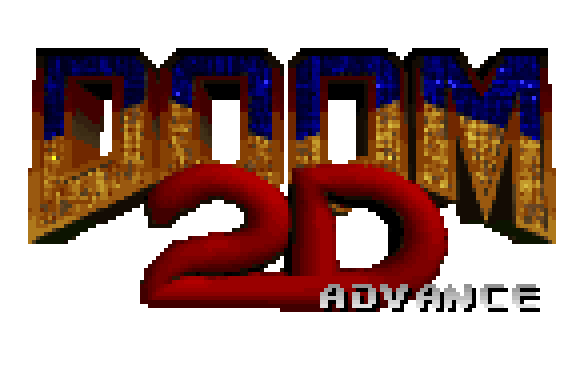
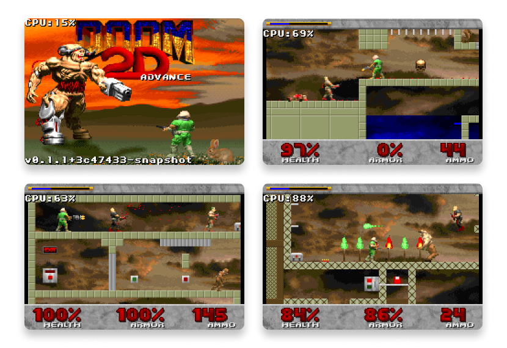

# Doom2D - Game Boy Advance Port

A port of *Doom2D* to the Game Boy Advance.

---

## Screenshots




## Requirements

1. **DevkitARM** ([Setup Guide](https://devkitpro.org/wiki/Getting_Started))
   - Windows: Use [DevkitPro Installer](https://github.com/devkitPro/installer/releases/latest).
   - macOS/Linux: Install via `devkitpro-pacman`.
     ```bash
     sudo dkp-pacman -S devkitARM
     ```
   - Verify: `arm-none-eabi-gcc --version`
2. **Python 3** for tools (e.g. build info, asset scripts).
3. **Butano** — included as a git submodule. After clone, run:
   ```bash
   git submodule update --init --recursive
   ```

---

## Build

```bash
make -j$(nproc)
```

---

## Contribution

1. **Fork** the repository.
2. **Clone** the forked repository (with submodules).
3. **Create a branch** for your feature.
4. **Test** your changes on emulators and hardware.
5. Submit a pull request.

---

## Credits

- **Doom2D** — original game by [PRIKOL Software](https://doom2d.org/).
- **[Butano](https://github.com/GValiente/butano)** by GValiente for the GBA development framework.

---

## License

Code is licensed under the [GNU General Public License v3.0](https://www.gnu.org/licenses/gpl-3.0.html). Original game assets may be under their respective licenses.
